```mermaid
graph LR
    A[🎯 2024 Goals] --> B[Master Web Dev]
    A --> C[Build Portfolio]
    A --> D[Open Source]
    A --> E[Competitive Programming]
    
    B --> F[React & Node.js]
    C --> G[Full Stack Projects]
    D --> H[Community Contributions]
    E --> I[Problem Solving Skills]
```

<div align="center">
  
</div>

<div align="center">
  
</div>

##  About Me

```typescript
const karthik = {
    pronouns: "He" | "Him",
    role: "Engineering Student & Tech Explorer",
    location: "India 🇮🇳",
    currentFocus: ["Web Development", "Problem Solving", "System Design"],
    learningGoal: "Exploring diverse fields in Computer Science",
    askMeAbout: ["C", "Python", "Java", "Web Dev", "College Life"],
    funFact: "I turn coffee into code and love experimenting with new tech! ☕→💻",
    hobbies: ["Coding", "Photo Editing", "Tech Blogging"],
    currentStatus: "Open to collaborations and new opportunities"
};
```

<div align="center">
  
</div>

##  Tech Arsenal

<div align="center">

### 🚀 Programming Languages
<p>
  
</p>

### 🛠️ Tools & Technologies
<p>
  
</p>

### 📚 Currently Exploring
<p>
  
</p>

</div>

<div align="center">
  
</div>

##  Connect With Me

<div align="center">

[](https://instagram.com/karthik490__20)
[](https://www.linkedin.com/in/karthik-nayak-b90105306)
[](https://x.com/karthiknayak26)
[](mailto:your.email@gmail.com)

</div>

<div align="center">
  
</div>

##  GitHub Analytics

<div align="center">
  
  
</div>

<div align="center">
  
</div>

<div align="center">
  
</div>

##  Current Projects & Goals

<div align="center">



</div>

##  Profile Insights

<div align="center">


</div>

##  GitHub Trophies

<div align="center">
  
</div>

---

<div align="center">
  
</div>

<div align="center">
  
### 💭 Random Dev Quote


</div>

<div align="center">
  
</div>

<div align="center">
  
  
</div>
